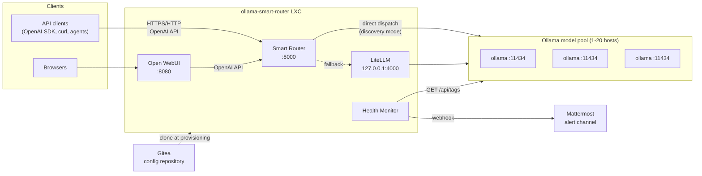
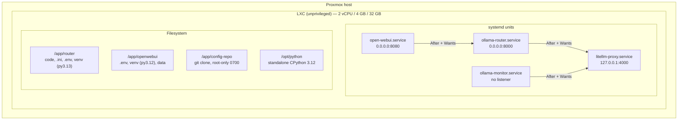
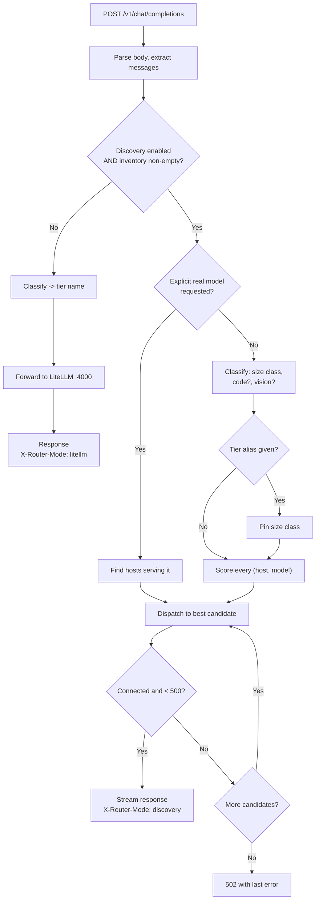
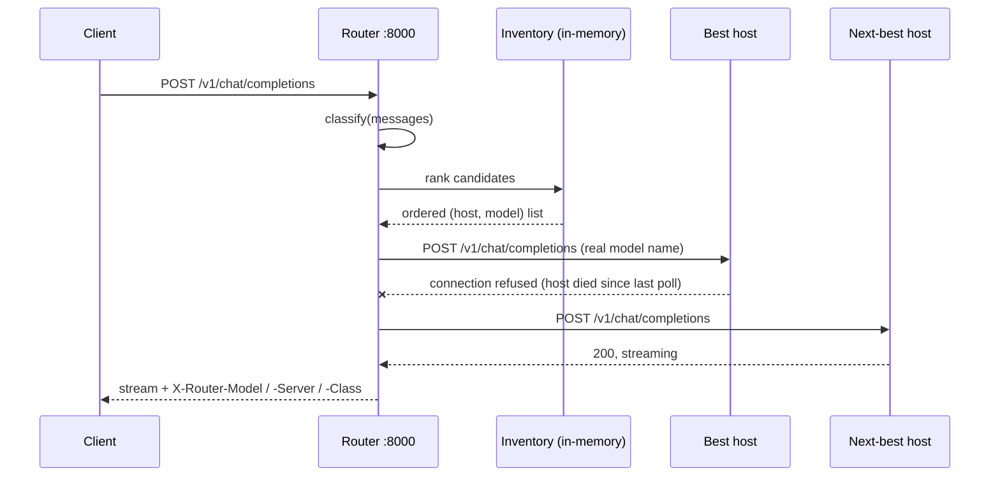
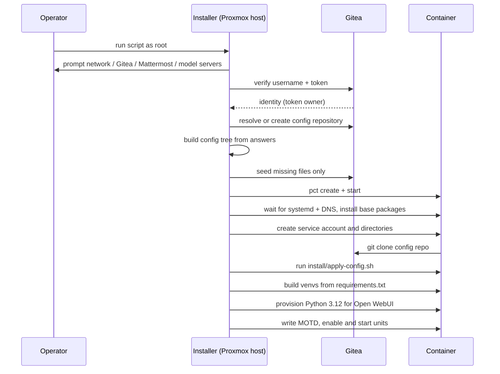

# Ollama Smart Router — Service Architecture

**System:** `ollama-smart-router`
**Platform:** Proxmox VE, unprivileged Debian 13 LXC
**Status:** as provisioned by `ollama-smart-router-install.sh`

---

## 1. Purpose and scope

The Ollama Smart Router presents a **single OpenAI-compatible API endpoint** in
front of a pool of self-hosted Ollama servers, and decides *per request* which
model on which host should answer it. It exists to solve three problems:

1. **Model sprawl.** A pool of Ollama hosts serves different models of different
   sizes. Clients shouldn't need to know which host has what.
2. **Cost/latency mismatch.** Sending "hi" to a 32B model wastes capacity;
   sending an architectural analysis to a 3B model wastes the answer.
3. **Operational drift.** Models get pulled and removed on individual hosts.
   Static configuration goes stale silently.

The system covers routing, load spreading, health alerting, a chat UI, and the
configuration lifecycle. It explicitly does **not** cover running Ollama itself
— the model hosts are external dependencies, managed separately.

### Quality attributes prioritised

| Attribute | How it is addressed |
|---|---|
| **Availability** | No service start depends on Gitea; routing degrades through three fallback layers; failed hosts are skipped mid-request |
| **Correctness of routing** | Live inventory rather than static assumptions; embedding models structurally excluded from chat |
| **Operability** | Every routing decision is inspectable via headers and endpoints; config is version controlled |
| **Reproducibility** | Whole system rebuilt from one script plus a git repo |
| **Least privilege** | One unprivileged service account; localhost-bound internals; hardened units |

---

## 2. System context



### External dependencies

| Dependency | Protocol | Criticality | Behaviour if unavailable |
|---|---|---|---|
| Ollama hosts | HTTP `:11434` | **Critical** | Router fails forward to other hosts; total loss → 502 |
| Gitea | HTTPS | **Provisioning only** | Install falls back to local config; running system unaffected |
| Mattermost | HTTPS webhook | Optional | Monitor logs alerts instead of posting |
| Proxmox host | — | Provisioning only | — |

> **Key design property:** after provisioning, the only runtime dependency is
> the Ollama pool. Gitea and Mattermost outages cannot stop the service or
> prevent it from booting.

---

## 3. Deployment view

All four services run in a single unprivileged LXC container as the same
non-login system account (`ollama-router`).



### Unit dependency rationale

* Every cross-service dependency is `After=` + `Wants=`, never `Requires=`.
  Ordering is real — the UI should come up behind the router, the router behind
  LiteLLM — but no service needs its upstream *present* in order to start. The
  router serves from its own discovery inventory; the monitor probes the Ollama
  hosts directly; the UI needs the router only when a request arrives.
* This is not a style preference. `Requires=` propagates stop and restart, so a
  crash-looping `litellm-proxy` stopped `ollama-router`, which stopped
  `open-webui`. That is fatal on a first install: Open WebUI runs its alembic
  migrations on first start, and being killed part way through leaves
  `data/webui.db` with a column added but the revision unstamped. Every later
  start then dies on `duplicate column name: info_json` and the UI never
  returns — with a clean journal on the unit that actually failed.
* All units are `Restart=always`. `open-webui` carries `TimeoutStartSec=600`
  because its first start downloads a local embedding model.

### Hardening applied to every unit

```
User=ollama-router      Group=ollama-router
NoNewPrivileges=true    PrivateTmp=true
ProtectSystem=full      ProtectHome=true
```

`ProtectSystem=full` makes `/usr`, `/boot` and `/efi` read-only. Everything the
services write lives under `/app`, so no `ReadWritePaths=` exemption is needed.
Adding one would be required if logs or venvs ever move to `/var` or `/opt`.

---

## 4. Component view

### 4.1 Smart Router (`ollama-router.service`) — the core

FastAPI/uvicorn service on `:8000`. The only component that makes routing
decisions.

| Endpoint | Purpose |
|---|---|
| `POST /v1/chat/completions` | Main path — classify, select target, dispatch |
| `GET /v1/models` | Advertises discovered models + `auto` and tier aliases |
| `GET /routing/inventory` | Live inventory, per-host up/down and errors |
| `POST /routing/refresh` | Force an immediate re-poll |
| `POST /routing/explain` | Show the decision and scored candidates, no execution |
| `GET /healthz` | Liveness of the router process itself |
| `ANY /v1/{path}` | Transparent passthrough to LiteLLM (embeddings, etc.) |

Internally it has three collaborating parts:

* **Discovery task** — an asyncio background loop polling every configured host's
  `/api/tags` on `refresh_seconds`. Writes a new inventory dict wholesale, so a
  reader never observes a half-built structure.
* **Classifier** — turns a conversation into requirements: size class
  (fast/medium/large/xlarge), whether it looks like code, whether it carries an
  image.
* **Selector + dispatcher** — scores every `(host, model)` pair, ranks them, and
  dispatches to the best, failing forward on error.
* **Decision recorder** — writes one JSON object per request to
  `/var/log/ollama-router/decisions.jsonl`.

#### Why the decision log exists

A routing decision is only evaluable against the decisions it *rejected*. The
model that answered tells you nothing about whether it should have; the
alternatives and their scores do. So the record keeps the whole comparison:

```
request    class, why that class, which keywords matched, length, prompt preview
ranking    candidate count, tie-group size, whether distance ranking was used
candidates every scored (host, model) pair: score, in_band, band_distance, and
           the score split into its band / code / vision / size terms
chosen     model, host, rank, score
attempts   each fall-forward hop with its outcome and latency
outcome    status, ttfb_ms, total_ms
```

`score_entry()` is a one-line wrapper around `score_breakdown()` so there is a
single implementation of the arithmetic and the logged terms can never drift
from the score that actually decided the routing. The terms are unrounded
inside the breakdown — `sum(terms) == score` exactly — and rounded once, at the
point the record is built.

The record is written from the response's `BackgroundTask`, after the last byte
has streamed, because that is the only point at which `total_ms` is knowable.
The one-line journal summary is emitted at dispatch instead, so `journalctl -f`
shows decisions live.

`POST /routing/explain` returns the identical shape without executing the
request, so a hypothesis formed from the log can be tested against a prompt
directly.

Cost is bounded by construction: `log_candidates` caps how many candidates are
stored, `prompt_chars` caps the text, and a `RotatingFileHandler` caps the file.
A log that cannot be opened disables itself with a warning — a router that
refuses to route because it cannot write a log would be a worse failure than
routing blind.

### 4.2 LiteLLM proxy (`litellm-proxy.service`)

Bound to `127.0.0.1:4000` — **not reachable from the network**. Serves two
purposes: it is the fallback dispatch path when discovery is unavailable, and it
backs the passthrough routes for non-chat OpenAI endpoints. Its
`litellm_config.yaml` is generated at install time with one deployment per
`(tier, host)` pair and `latency-based-routing` plus cross-tier fallbacks.

### 4.3 Open WebUI (`open-webui.service`)

Chat UI on `:8080`. Points at the **router**, not at LiteLLM, so UI traffic is
smart-routed. Runs from its own virtualenv on **Python 3.12** — every
`open-webui` release requires `>=3.11,<3.13` while Debian 13 ships 3.13, so the
installer provisions a dedicated interpreter for it (see §7.3).

### 4.4 Health monitor (`ollama-monitor.service`)

No listener. Polls each distinct host once per cycle and posts state
*transitions* only — down and recovery. A healthy, unchanged cluster is silent.

**Health is a property of the host, not of the tier.** State is keyed by URL and
the message names every tier the host serves. Keying it per `(tier, host)` meant
one unreachable box produced one alert per tier it backed — and since a
single-server deployment points all four tiers at the same URL, one outage
posted four identical messages and four more on recovery.

Three mechanisms keep the channel quiet, all configurable under `[alerting]` in
`monitor.ini`:

| Mechanism | Default | Problem it solves |
|---|---|---|
| `failure_threshold` / `recovery_threshold` | 3 / 2 consecutive probes | A backend answering slowly — one probe timing out, the next succeeding — otherwise alternates down/up **every cycle, forever**. Thresholds of 1 reproduce that flood. |
| `state_file` (systemd `StateDirectory=`) | `/var/lib/ollama-monitor/state.json` | Held only in memory, health defaulted to "everything is up", so each restart rediscovered an ongoing outage and re-announced it. With `Restart=always` that is one message per `RestartSec` for the length of the outage. |
| `startup_notice` | `auto` | The webhook self-test is useful on a first start and after a reconfiguration, and pure noise on the 400th restart. `auto` posts only when there is no prior state or the watched set changed. |

On top of those, the send path itself is guarded. The state file carries
`last_check` (the raw probe result for the most recent cycle), `last_check_at`,
and `last_posted_digest` — a fingerprint of the believed health of every watched
host at the moment of the last message. `announce()` recomputes that fingerprint
and **drops the message if it is unchanged**, so an unchanged cluster cannot
produce a post even if the debouncing above were bypassed entirely. The
fingerprint is written back after a successful post, which is why the loop saves
state twice on a transition cycle and not at all in steady state.

`repeat_seconds` (default `0`, off) is the single deliberate exception: it
re-reports an outage that is still ongoing, and is excluded from the digest
guard by design. Transitions occurring in the same cycle are batched into one
message.

State is written **before** the message is posted: if the post hangs and the
unit is killed, a lost alert beats a duplicated one. An unwritable or corrupt
state file degrades to memory-only with a warning rather than failing the
daemon, and settings are read through a section-safe accessor — `ConfigParser`'s
`fallback=` covers a missing *option* but still raises `NoSectionError` for a
missing *section*, which would otherwise crash-loop the daemon against a
hand-trimmed `monitor.ini`.

It also runs the **keep-alive maintainer**. Ollama's OpenAI-compatible endpoint
does not accept a `keep_alive` field, so a model driven through the router would
always use the server default and unload after ~5 minutes idle. The maintainer
works around this by periodically calling each healthy host's *native*
`/api/chat` with an empty message list and the configured `keep_alive`, which
loads the model and resets its unload timer without generating anything. It runs
only when `OLLAMA_KEEP_ALIVE` is set; blank leaves each server's own setting in
charge. Down hosts are skipped so a dead host never stalls the cycle.

**Webhook delivery.** An incoming webhook is bound to one channel, and many
Mattermost servers refuse a payload that names a different one — which surfaces
as a 4xx that reads like a permissions failure. On any 4xx the monitor retries
once **without** the `channel` field and logs a warning, so the alert lands in
the webhook's own channel rather than being dropped. `MATTERMOST_VERIFY_TLS`
covers the other common failure, an internal CA. `manage-model-servers
test-alert` reproduces the exact payload and reports which of the two applies.

---

## 5. Request routing

### 5.1 Decision flow



### 5.2 Scoring heuristics

Each `(host, model)` pair is scored; highest wins.

| Signal | Effect |
|---|---|
| **Size-band fit** | Request class maps to a parameter band (`0:9`, `9:20`, `20:70`, `70:999` billions). Ceilings are **exclusive**, so the bands are disjoint. In-band scores 1.0; outside decays linearly by `band_falloff` rather than disqualifying. When *nothing* is in band, candidates are ordered by distance to the band instead of by score — the falloff floors at zero, so otherwise every candidate ties and load-rotation would pick arbitrarily |
| **Code specialisation** | `+code_match` when a code request meets a code model; `−code_match × offtask_penalty` when a code model takes prose |
| **Vision** | `+vision_match` when an image request meets a vision model; `−vision_match` when it doesn't; small off-task penalty for a vision model on plain text |
| **Extremes within class** | Large requests bias larger, fast requests bias smaller |
| **Unknown size** | Scores `unknown_params` (0.3) — usable but never preferred |
| **Embeddings** | **Structurally excluded.** Never eligible for chat, regardless of prompt |
| **Tie rotation** | Candidates within `tie_epsilon` of the best rotate, spreading load across hosts serving the same model |

Parameter counts come from `details.parameter_size`, falling back to parsing the
tag (`qwen3:14b` → 14B) when the field is absent.

All weights, bands and classification keyword lists live in `router.ini` in the
config repo — routing behaviour changes by commit, not by editing Python.

### 5.3 Dispatch sequence (discovery mode)



Retry is only attempted **before** any response body is streamed. Once bytes
reach the client the exchange is committed, since a partial stream cannot be
replayed against a different host.

### 5.4 Three-layer degradation

| Layer | Trigger | Behaviour |
|---|---|---|
| 1. Best candidate | Normal | Direct dispatch to highest-scoring host |
| 2. Fail-forward | Connect error / 5xx | Next candidate in ranked order |
| 3. LiteLLM fallback | Discovery off, or inventory empty | Static tier routing with LiteLLM's own fallbacks |

---

## 6. Configuration architecture

Configuration is **version controlled in Gitea and injected at provisioning
time** — a deliberate middle ground between baked-in config and full GitOps.

```
services/ollama-router/     router.py  router.ini  requirements.txt  *.service
services/litellm-proxy/     litellm_config.yaml    requirements.txt  *.service
services/ollama-monitor/    monitor.py monitor.ini requirements.txt  *.service
services/open-webui/        requirements.txt       *.service
env/router.env              shared env for router / litellm / monitor
env/openwebui.env           Open WebUI environment
install/apply-config.sh     copies everything into its runtime location
```

One directory per service means each service's unit, code, tunables and
dependency pins version independently.

### 6.1 Changing the server list — `manage-model-servers`

`install/manage-model-servers.sh` is seeded into the repo and symlinked to
`/usr/local/bin/manage-model-servers`, so it versions alongside the config it
edits and a `git pull` updates the command.

```
manage-model-servers list | status | discover | models
manage-model-servers add <addr> [--tier fast,large] [--apply] [--commit]
manage-model-servers remove <addr|#> [--apply]
manage-model-servers set-tier  <tier> <addr...>  [--apply]
manage-model-servers set-model <tier> <model>    [--apply]
```

It rewrites `MODEL_SERVERS` and the per-tier `BACKEND_*` entries in
`env/router.env`, regenerates `litellm_config.yaml` from the tier assignments,
then optionally applies and restarts. Design points:

* **Servers are keyed by URL, never by index** — removing one can never
  silently re-point another tier at the wrong host.
* New hosts are **probed for `/api/tags`** before being accepted (`--no-probe`
  overrides).
* Model tags and the whole `router_settings` block are **read back from the
  existing YAML** and preserved, so hand edits survive regeneration.
* The `.env` rewrite copies content rather than replacing the file, keeping its
  `0640 root:ollama-router` mode.
* Models are held per **(tier, server)** deployment, matching LiteLLM's own
  model_list structure, so hosts of different capability inside one tier can
  serve different models. `set-model <tier> <model>` sets them all;
  `set-server-model <tier> <server> <model>` sets exactly one. Regeneration
  preserves each pair's existing tag — collapsing a tier to a single tag would
  silently discard per-server assignments on the next add/remove.
* Both verify the tag is **actually present** on the affected server(s) before
  writing it (`models` lists what is available; `--no-probe` overrides for a
  not-yet-pulled model).
* **The repo is on PATH inside the container.** `apply-config.sh` makes every
  `*.sh` in the repo executable (skipping `.git/`) and writes a `profile.d`
  snippet appending the repo root and `install/` to `PATH`. Appended rather
  than prepended, so a committed file cannot shadow a system binary. Because
  `profile.d` is read only by login shells, the `/usr/local/bin` symlink is
  kept for `pct exec` — and it is created as the script's *first* action, so a
  failure further down cannot leave a half-applied system without its
  management command. The repo stays `0700 root:root` throughout: `router.env`
  holds live secrets, so this is operator convenience, not a grant to the
  service account.
* **No automatic config migration.** The tiers were renamed twice
  (`BACKEND_QWEN_HEAVY` → `BACKEND_HEAVY` → `BACKEND_LARGE`, and
  `model_name: qwen-heavy` → `heavy` → `large`), but the management script does
  not rewrite an older config — upgrading is reprovisioning or a hand edit, so
  nothing mutates a deployment behind the operator's back. The Python services
  do still resolve the old env key names through a read-only fallback chain, so
  a service starting against an un-migrated `router.env` finds its backends
  instead of coming up healthy with none. Anything `router.ini` omits falls back
  to the built-in defaults in `router.py`, so a config predating the `xlarge`
  tier still loads.
* `commit` authenticates with the deploy token from `router.env`. Gitea rejects
  account passwords for git-over-HTTP, and the stored git credentials are
  deleted after provisioning, so the token is written to a temporary 0600
  credential file for the duration of the push — never onto the command line.
  The credential entry uses the **same URL scheme as the remote**; git will not
  match an `https://` credential against an `http://` request. Interactive
  prompting is disabled so a bad token fails immediately rather than hanging.
* Guard rails: minimum/maximum server count, unknown tier, unconfigured server,
  duplicate address, `ollama/` prefix, and a warning when a tier is left empty.

Note that a tier's model tag governs the **LiteLLM fallback path**. In discovery
mode the router selects a model from the live inventory, so changing the tag
does not by itself change discovery-mode routing — the tool says so when you
change it.

The router picks up an added host on its next discovery poll; `--apply` mainly
matters for LiteLLM's static path.

### Why provisioning-time pull, not pull-on-start

A `git pull` in `ExecStartPre` would make **Gitea a boot dependency of every
service**. A Gitea outage during a container restart would then take down
routing entirely, and a bad commit would break startup rather than being caught
at install. Pulling once at provisioning keeps the blast radius of the config
system confined to install time.

Changing config on a running container is an explicit, reversible act:

```bash
cd /app/config-repo && git pull
./install/apply-config.sh
systemctl daemon-reload
systemctl restart litellm-proxy ollama-router ollama-monitor open-webui
```

---

## 7. Provisioning architecture



### 7.1 Fail-fast ordering

Everything that can be validated cheaply happens **before** `pct create`:
prompts, input validation, Gitea authentication and repo resolution, and
storage capacity. A typo, a bad token, or a disk without room costs a re-prompt
rather than a wasted build. An `ERR` trap destroys a half-provisioned container
so a failed run never leaves debris.

**Storage selection** resolves candidates in three steps, because
`pvesm status -content <type>` returns an empty table on some setups:

1. the server-side filter, if it returns rows;
2. otherwise the full `pvesm status` table intersected with the `content=`
   lines in `/etc/pve/storage.cfg`;
3. if that config is readable and declares the type nowhere, that is treated as
   a definitive "none" — offering a storage that cannot hold a container would
   only move the failure into `pct create`. If the config is unreadable, all
   active storages are offered with a warning that they are unverified.

Failure prints full diagnostics (both pvesm invocations, the declared content
types, and the `pvesm set <storage> --content rootdir,images` fix) and allows a
manually typed storage name. Only storages with enough free space for the
chosen rootfs are selectable; the rest are listed but not. Columns are located by header name, not position. Two things make a fixed
index wrong: `pvesm` has reordered `used`/`available` between releases, and the
header carries unit annotations as separate whitespace-delimited tokens
(`Total (KiB)  Used (KiB)  Available (KiB)`), so the header has 10 fields while
the data rows have 7. Parenthesised units are stripped before column positions
are computed — without that, `Available` resolves to field 8, every 7-field data
row fails the bounds check, and the installer reports "no storage found" on a
perfectly healthy host. Sizes are KiB (pvesm divides bytes by 1024) and are floored to GiB so
a capacity report is never optimistic. Inactive storages are excluded. The same
check guards the template storage against `TEMPLATE_MIN_GIB`.

### 7.2 Seeding policy

The installer pushes only files the repository **does not already have**, so
committed edits always win over generated defaults. If no usable token exists,
the tree is shipped into the container directly and applied through the same
`apply-config.sh` path — identical end state, minus version control.

### 7.3 Dual Python runtimes

| Runtime | Used by | Source |
|---|---|---|
| System Python 3.13 | router, LiteLLM, monitor (shared venv) | Debian 13 |
| Python 3.12 | Open WebUI (own venv) | Existing binary → distro package → `uv` standalone build in `/opt/python` |

Open WebUI requires `>=3.11,<3.13`; Debian 13 ships 3.13, so **every**
`open-webui` release is filtered out by pip's `Requires-Python` gate. Candidate
interpreters are validated by executing them **as the service account** — an
interpreter under `/root` satisfies a root-run check but produces a venv that
fails at service start.

---

## 8. Network and ports

| Port | Service | Binding | Exposure |
|---|---|---|---|
| 8000 | Smart Router | `0.0.0.0` | LAN — the OpenAI-compatible API |
| 8080 | Open WebUI | `0.0.0.0` | LAN — browser UI |
| 4000 | LiteLLM | `127.0.0.1` | **Container-local only** |
| 11434 | Ollama hosts | outbound | Router and monitor → model pool |

When the container firewall is enabled, the installer writes explicit accept
rules for 8000 and 8080 from a trusted CIDR. LiteLLM needs no rule because it
never leaves the loopback interface.

---

## 9. Security model

### Identity and privilege

* Unprivileged LXC; services run as the non-login `ollama-router` account.
* systemd hardening as listed in §3.
* The root password is set over stdin via `chpasswd`, never passed as a
  command-line argument where it would appear in the Proxmox host's process list.

### Secret handling

| Secret | At rest | Notes |
|---|---|---|
| Gitea deploy token | `env/router.env`, `0640 root:ollama-router` | Also committed to the repo |
| Mattermost webhook | same | Also committed |
| Container root password | `/etc/shadow` | Never written to a file by the installer |

Configuration files are **built on the Proxmox host and pushed in**, never
assembled by an inner shell. This closes an injection and mangling class:
a token containing `'`, `$` or a backtick would otherwise break quoting or be
silently expanded.

The cloned repository is `chown root:root` + `chmod -R go-rwx`, because `git
clone` writes mode 0644 by default — without this the clone would be *more*
permissive than the 0640 runtime copy it feeds.

### Accepted risks

| Risk | Rationale | Mitigation available |
|---|---|---|
| **Secrets committed to git** | Chosen for operational simplicity; repo is private | Rotate the token if the repo is ever shared or mirrored |
| **`GITEA_VERIFY_TLS=false`** | TurnKey appliance ships a self-signed certificate | Install the appliance CA and flip the flag in `prompt_gitea_credentials` |
| **No auth on the router API** | Trusted LAN deployment | Firewall CIDR; add a reverse proxy with auth if exposed |
| **Deploy token grants access to the Gitea storing it** | Same-system credential | Scope the token to the single repository |

---

## 10. Failure modes

| Failure | Detection | System behaviour | Operator signal |
|---|---|---|---|
| One Ollama host down | Connect error mid-request; `failure_threshold` consecutive failed probes | Fail-forward to next candidate; dropped from inventory | One Mattermost alert naming every tier it served; `/routing/inventory` |
| All Ollama hosts down | Empty inventory | Falls back to LiteLLM path, which also fails → 502 | One batched alert listing every host |
| A host flapping (intermittent timeouts) | Streak counters never reach a threshold | Treated as up; no churn | Nothing posted — check `/routing/inventory` and the probe latency |
| Monitor restarted during an outage | Health reloaded from `state_file` | Outage is remembered, not re-announced | `Resuming with N backend(s) already known down` in the journal |
| Monitor `state_file` unwritable | Write failure | Degrades to memory-only; alerting still works | One warning; restarts will re-announce |
| A model removed from a host | Next discovery poll | Stops being a candidate within `refresh_seconds` | Inventory diff |
| Gitea unreachable at install | Auth probe | Local config mode; provisioning completes | Explicit console warning |
| Gitea unreachable at runtime | — | **No effect** — nothing reads it | — |
| Mattermost webhook rejected | HTTP status check | Alerts logged instead | `journalctl -u ollama-monitor` |
| LiteLLM down | Unit failure | Discovery path unaffected; fallback path fails | `systemctl status` |
| Router down | Unit failure | UI and API unavailable; `Restart=always` recovers | — |
| Bad `router.ini` committed | Config parse | Built-in defaults fill missing keys; service still starts | — |
| Provisioning failure | `ERR` trap | Container destroyed, no debris | Script exits non-zero |

---

## 11. Scaling and performance

* **Horizontal:** 1–20 Ollama hosts. Tiers may hold several hosts; LiteLLM
  load-balances the static path, and the router rotates tied candidates on the
  discovery path.
* **Vertical:** the container itself is I/O-bound glue — inference happens
  entirely on the model hosts. 2 vCPU / 4 GB is sized for Open WebUI's embedding
  model, not for routing.
* **Disk:** a default Open WebUI install pulls CUDA-enabled torch plus ~4.5 GB
  of `nvidia-*` wheels, giving a ~7.5 GB venv (measured). The container has no
  GPU, so `TORCH_CPU_ONLY` defaults to **true**: CPU-only torch is installed
  before Open WebUI, leaving pip's torch requirement satisfied so the CUDA stack
  is never resolved. Upgrades additionally purge orphaned `nvidia-*`/`triton`
  wheels. The CPU install is attempted first, before anything is removed, so an
  unreachable index degrades to the CUDA build instead of breaking the venv.
* **Discovery cost:** one `GET /api/tags` per host per `refresh_seconds`,
  independent of request volume. Routing decisions are pure in-memory scoring.

---

## 12. Observability

| Surface | What it answers |
|---|---|
| `X-Router-Model` / `-Server` / `-Class` / `-Mode` / `-Candidates` | Why did *this* request go where it went |
| `GET /routing/inventory` | What does each host currently serve; who is down and why |
| `POST /routing/explain` | What *would* happen to this prompt, with scores |
| `journalctl -u <unit>` | Service logs; monitor logs suppressed alerts too |
| `/var/log/ollama-router/decisions.jsonl` | Every routing decision with all candidate scores |
| `manage-model-servers routing-stats` | Whether the scoring is discriminating, and where it drifted |
| `X-Router-Request-Id` | Ties a response back to its record in the decision log |
| Mattermost `#ollama-monitor` | Host up/down transitions, and a startup confirmation on first start or reconfiguration |
| `/var/lib/ollama-monitor/state.json` | What the monitor believes about each host, and when it last said so |
| `/etc/motd` | Ports, tier map, config paths at login |

---

## 13. Key design decisions

| Decision | Alternative rejected | Reason |
|---|---|---|
| Routing logic in the router, not LiteLLM | Extend LiteLLM config | LiteLLM's model map is static YAML; dynamic discovery would mean regenerating and reloading config per change |
| Direct dispatch when discovery succeeds | Always route via LiteLLM | Router-side ranking is inventory-aware; fail-forward replaces LiteLLM's fallbacks with something better informed |
| Keep LiteLLM as fallback | Remove it | Preserves a tested static path when discovery is unavailable, and serves non-chat OpenAI routes |
| Pull config at provisioning | `ExecStartPre` git pull | Avoids making Gitea a boot dependency of every service |
| Separate venv + Python for Open WebUI | Shared venv | Hard version constraint (`<3.13`) and conflicting pins with LiteLLM |
| Keyword lists as JSON arrays in `.ini` | Comma-separated | Preserves exact spacing — `"def "` must not match `default` |
| Seed only missing files | Always overwrite | Operator commits win over generated defaults |
| Embeddings structurally excluded | Score them low | A low score is still selectable; an embedding model cannot serve chat at all |

---

## 14. Known limitations

1. **The host list changes out-of-band.** Discovery finds *models* on configured
   hosts, not new hosts. Adding or removing a host is a deliberate act via
   `manage-model-servers` (§6.1) rather than something the system detects.
2. **Classification is lexical.** Prompt length and keyword matching approximate
   complexity; they will misclassify adversarial or unusual phrasing. Thresholds
   are tunable, but there is no semantic understanding of difficulty.
3. **No request-level authentication** on the router or UI beyond Open WebUI's
   own accounts.
4. **No queue or concurrency control.** A saturated host is not detected as
   "busy" — only as up or down. Latency-aware selection is limited to LiteLLM's
   static path.
5. **Single container.** The router itself is not redundant; the container is a
   single point of failure for the API surface.
6. **Secrets in git**, by explicit choice — see §9.

### Natural next steps

* Feed observed latency back into candidate scoring (turn health into a gradient
  rather than a boolean).
* Optional API-key auth at the router.
* Add hosts dynamically via a config endpoint, rather than via the CLI tool.
* Track in-flight requests per host to avoid piling onto a saturated one.

---

## Appendix A — Runtime file layout

```
/app/router/.env                  shared runtime config (secrets, 0640)
/app/router/router.py             complexity router + discovery + proxy
/app/router/router.ini            routing thresholds, keywords, weights, bands
/app/router/monitor.py            backend health monitor
/app/router/monitor.ini           polling tunables
/app/router/litellm_config.yaml   tier -> backend mapping, fallbacks
/app/router/venv/                 router + litellm + monitor deps (py3.13)
/app/openwebui/.env               Open WebUI config (0640)
/app/openwebui/venv/              Open WebUI deps (py3.12)
/app/openwebui/data/              Open WebUI state (DATA_DIR)
/app/config-repo/                 cloned config repo (root-only, 0700)
/opt/python/                      standalone CPython 3.12 (if uv-provisioned)
/etc/systemd/system/*.service     the four units
/etc/motd                         login summary
```

## Appendix B — Configuration surface

| File | Owns |
|---|---|
| `router.ini` | Size thresholds, keyword lists, tier names, discovery bands and weights |
| `monitor.ini` | Poll interval, timeout, health path, keep-alive maintenance |
| `env/router.env` | Backend URLs per tier, full host list, per-tier model tags, keep-alive, credentials, LiteLLM URLs |
| `env/openwebui.env` | UI port, data dir, upstream API base, auth toggle |
| `litellm_config.yaml` | Static tier → host deployments, routing strategy, fallbacks |
| `requirements.txt` (×4) | Dependency pins, per service |
